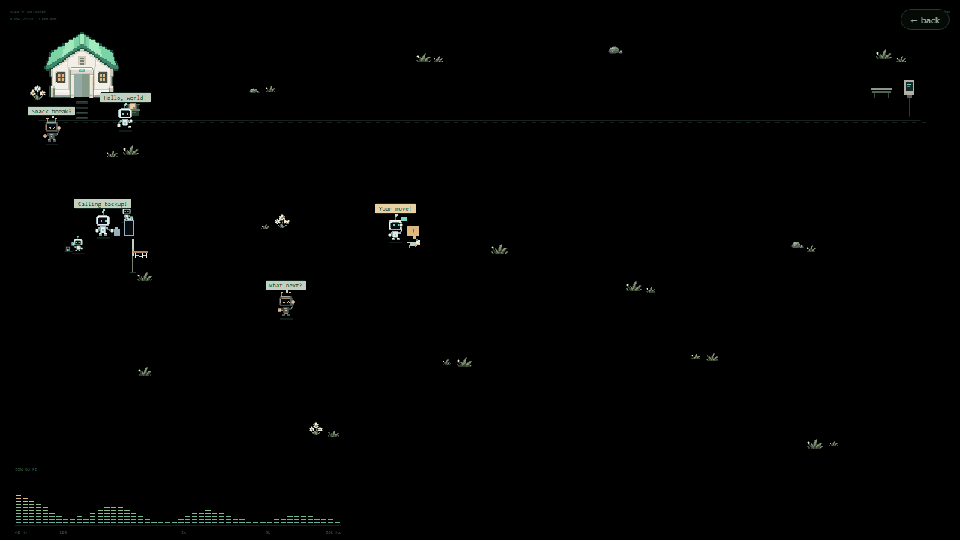
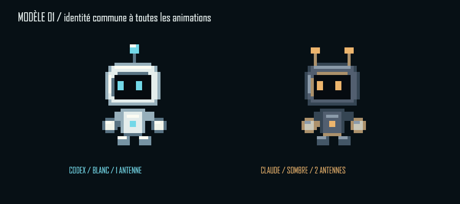
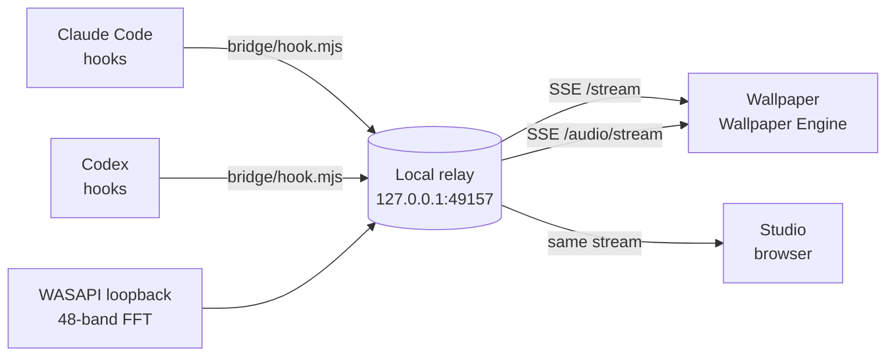

<div align="center">


# Agentic Wallpaper

**A live pixel-art wallpaper where your Claude Code and Codex sessions are little robots.**

They leave the house when you prompt, read, search, run tests, spawn sub-agents,<br>and walk back home when the answer ends. Free, local, no API key.

[](https://drmoussavie.github.io/agentic-wallpaper/)
[](https://github.com/DrMoussavie/agentic-wallpaper/releases/latest/download/agent-transit-wallpaper.zip)

[](LICENSE)
[](docs/INSTALL-WALLPAPER-ENGINE.md)
[](package.json)
[](#)
[](tests)

🇫🇷 [Documentation complète en français](docs/README.fr.md) · [Tuto d'installation](docs/INSTALLATION-WALLPAPER-ENGINE.fr.md)



</div>

---

## What it is

Agentic Wallpaper is a **[Wallpaper Engine](https://www.wallpaperengine.io/) web wallpaper** plus a tiny **local relay**. The relay receives the hook events that Claude Code and Codex already emit (session start, prompt, tool use, sub-agent, stop…) and streams them to the wallpaper. Each session becomes a robot in a procedural pixel-art garden.

<table>
<tr>
<td width="50%" valign="top">

**Codex** — white & cyan, one antenna<br>
**Claude** — dark & amber, two antennas

Same rig, 22 animations each: arrive, think, read, search, type, tool, test, send, receive, spawn, wait, error, compact, celebrate, pause, sleep, wake, clean, archive, offline, idle, walk.

</td>
<td width="50%">

</td>
</tr>
</table>

## Features

- 🏠 **A common house.** Robots rest inside, come out through the door when a prompt arrives, sit on the bench of a paved waiting corner beside the house holding up the reply once the answer ends ("All yours!"), and walk home after five minutes or the next nap signal. The bench scales with the screen (2–5 seats). A new prompt brings them back out — no teleporting.
- 🤖 **Sub-agents** appear as mini-bots orbiting their parent and report back when they finish.
- 📬 **Prompts land in the robot's hands.** The letter waits at the terminal until its robot is standing in the garden, then flies down the conduit and is caught mid-gesture — no more envelopes stuck at the door. A robot stepping out for a prompt gets a little splash.
- 🌀 **Sub-agents step out of the portal** their parent opens while "Calling backup!", not out of the house.
- 🐕 **A mechanical dog** patrols, flags waits and errors, fetches the ball you throw on the desktop, chases the butterfly, and shows a heart if you hold a click on it.
- 🏀 **A basketball hoop that moves after every basket.** Always on a free spot, facing the screen centre. Drag-and-release the ball through it, or watch idle robots fetch the ball from the toy box and shoot (about 60 % accuracy). Streak, points and a locally saved best streak; real work always interrupts the game.
- 🦋 **The garden lives on its own.** A butterfly visits the flowers by day; fireflies drift at night (21:00–07:00 local time). Hold a beat with real bass for a few seconds and idle robots dance while the flowers wobble.
- 🎵 **Audio spectrum** of your PC sound — 48 log bands, 40 Hz to 20 kHz — with the current track title and artist (via Wallpaper Engine media integration).
- 💬 **Speech bubbles** for actions, never for conversations.
- 🖱️ **Interactive.** Click the garden to call idle robots over; click a robot to make it wave; drag to throw the ball.
- 📐 **Any screen shape.** Landscape, portrait, square, ultrawide: the garden lays itself out and stays stable when the population changes.
- 🎛️ **Tunable** from the Wallpaper Engine panel: background, character size, conduits, dog, ball, hoop, visitors, roaming, bubbles, spectrum width, taskbar margin, audio source.
- 🚫 **No fake agents, ever.** If the relay is down the garden says so instead of pretending.

## Install

**Just the wallpaper (decor, dog, ball, native audio) — no Node needed:**

1. Download [`agent-transit-wallpaper.zip`](https://github.com/DrMoussavie/agentic-wallpaper/releases/latest/download/agent-transit-wallpaper.zip) and unzip it.
2. Copy the folder to `…\steamapps\common\wallpaper_engine\projects\myprojects\agent-transit\`.
3. In Wallpaper Engine → **Installed**, pick **Agentic Wallpaper**. Set *Spectrum source* to *Native WE audio* if you skip the relay.

**Live agents — works with Claude Code *and* Codex, both at once.**

**One-shot installer** (Node.js 20+ required — `winget install OpenJS.NodeJS.LTS`):

```powershell
git clone https://github.com/DrMoussavie/agentic-wallpaper
cd agentic-wallpaper
powershell -ExecutionPolicy Bypass -File Install.ps1
```

`Install.ps1` installs the dependencies, merges the hooks into Claude Code and Codex (backups kept), builds and copies the wallpaper into Wallpaper Engine, and registers the relay autostart — a per-user scheduled task that starts the relay **only while Agentic Wallpaper is selected** in Wallpaper Engine and lets it exit after 10 minutes without a wallpaper or Studio connected. Switch to another wallpaper and nothing keeps running. A little robot walks across the console while it works. `Uninstall.ps1` undoes all of it (`-KeepHooks`, `-KeepWallpaper` to keep parts).

<details open>
<summary><b>🤖 Let your agent install it</b> — paste this into Claude Code or Codex on your Windows PC</summary>

```text
Install Agentic Wallpaper from https://github.com/DrMoussavie/agentic-wallpaper on this Windows PC so it works with BOTH Claude Code and Codex.

1. Check Node.js >= 20 is available (install it with winget if not).
2. Clone the repo into a permanent folder, e.g. %USERPROFILE%\agent-transit, then run: npm install
3. Run: npm run hooks:install  (it merges the hooks into ~/.claude/settings.json and the Codex config, keeps backups, changes nothing else).
4. Run: powershell -NoProfile -ExecutionPolicy Bypass -File scripts/configure-startup.ps1  so the relay starts automatically (only while the wallpaper is selected in Wallpaper Engine), then start it now in the background with: npm start
5. Verify http://127.0.0.1:49157/health answers.
6. Run: npm run export  and copy dist/wallpaper to <Steam>\steamapps\common\wallpaper_engine\projects\myprojects\agent-transit (find my Steam library path first).
7. Select "Agentic Wallpaper" in Wallpaper Engine → Installed is a click I do myself; just tell me.
8. IMPORTANT — end your answer with an explicit reminder, in bold: if I use Codex, I must approve the hooks myself in the Codex app (Settings → Hooks → From configuration → Approve on each Agentic Wallpaper entry), otherwise they are silently ignored and no robot will appear. If I use Claude Code, nothing to approve: the hooks are picked up automatically.

Do not touch anything else in my Claude Code or Codex settings.
```

</details>

> **After the install:** **Claude Code** needs nothing more — the hooks in `~/.claude/settings.json` are picked up automatically. **Codex** needs one click: *Settings → Hooks → From configuration → Approve* on the Agentic Wallpaper entries; unapproved hooks are silently ignored.

**Or by hand:**

```bash
git clone https://github.com/DrMoussavie/agentic-wallpaper
cd agentic-wallpaper
npm install
npm run hooks:install   # merges the hooks into Claude Code and Codex settings (backups kept)
npm start               # relay on http://127.0.0.1:49157
```

Then approve the hooks in the Codex app (*Settings → Hooks → From configuration → Approve*), send a message in any local session, and watch a robot leave the house.

📖 **Full walkthrough with settings and troubleshooting: [docs/INSTALL-WALLPAPER-ENGINE.md](docs/INSTALL-WALLPAPER-ENGINE.md)**

## How it works



- **`bridge/hook.mjs`** is what the agents call. It posts a small JSON to the relay with a 500 ms timeout and always returns `{}` — it never blocks or decides anything.
- **`bridge/server.mjs`** normalizes events, keeps the world state, reconciles missed sub-agent endings every 60 s, and streams snapshots to every connected client.
- **`public/world.js`** is the shared state machine; **`public/life.js`** the garden, the house and the walking; **`public/free-renderer.js`** draws everything on a canvas at native resolution.

### Privacy

- The relay binds to `127.0.0.1` only. Session ids are hashed.
- Prompts, messages, file contents and commands are **never** sent to the wallpaper — only the *kind* of activity.
- No model API is called, no API key is needed. Nothing leaves your machine.
- What can and cannot be detected, honestly listed: [docs/AUDIT-DETECTION.md](docs/AUDIT-DETECTION.md).

## Development

```bash
npm start            # relay + studio at http://127.0.0.1:49157/
npm test             # node --test tests/*.test.mjs
npm run export       # builds dist/wallpaper for Wallpaper Engine
node scripts/site-build.mjs   # builds the GitHub Pages site into _site/
```

| URL (relay running) | What |
|---|---|
| `/` | Studio: live activity, settings, four aspect-ratio previews |
| `/boards.html` | Workshop of the 22 animations, with sheet inspector |
| `/props.html` | Gallery of the generated props |
| `/wallpaper.html` | The wallpaper alone, full window |
| `/health` | Event counters per provider |

More docs (French): [style guide](docs/STYLE.md) · [interactions](docs/INTERACTIONS.md) · [image prompts](docs/IMAGE-PROMPTS.md) · [props prompts](docs/PROPS-PROMPTS.md) · [audio & reset](docs/RESET-ET-AUDIO.md).

## Roadmap

Actively developed. Ideas and bug reports welcome in [Issues](https://github.com/DrMoussavie/agentic-wallpaper/issues).

- [ ] One-click companion installer (relay + hooks) for people who do not want Node
- [ ] Workshop publication of the decorative wallpaper
- [ ] macOS / Linux relay for the browser and window modes

## License

[CC BY-NC 4.0](LICENSE) — use it, modify it, share it, credit it; no commercial use.

Claude Code and Codex are trademarks of their respective owners. Agentic Wallpaper is an independent project and is not affiliated with Anthropic or OpenAI. The robots, the garden and every asset in this repository are original.
